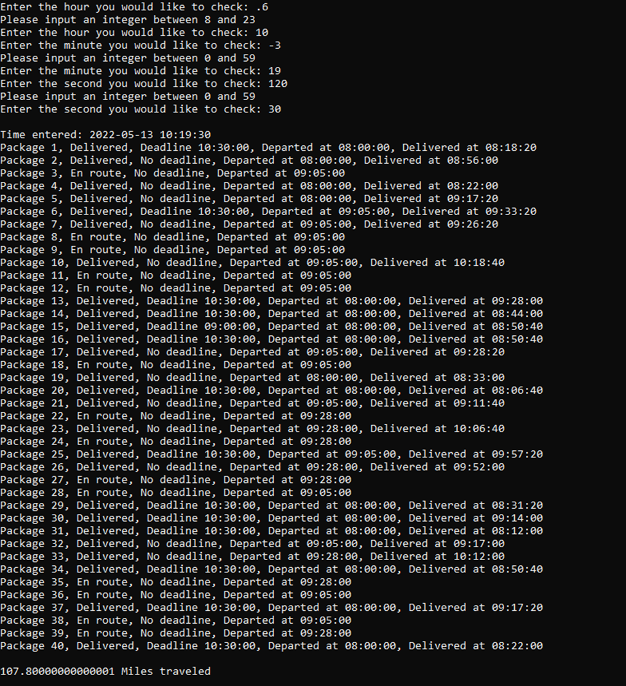

<br><br><br><br>

# Data Structures and Algorithms 2 – C950: Write Up

## Brady Bassett

## Western Governors University

## C950 – Data Structures and Algorithms 2
<br><br>
## Algorithm Identification

`	`In order to solve this problem, I used a combination of two different algorithms in order to get the result I desired. The first algorithm that is used is Prims Algorithm. This algorithm is a greedy algorithm designed to find a minimum spanning tree for a weighted undirected graph. By selecting a node in the graph at random the algorithm can initialize the tree from this node, growing it by finding the minimum weight edge connected to that node and then added the node as a child to the parent. This is repeated, ignoring all visited nodes, until all nodes are in the tree.

`	`The second algorithm use is the Depth-first Search algorithm. This algorithm is designed to traverse trees or graph data structures, starting from a root node, and traveling as far down each branch as possible before backtracking. Each node that is accessed will be added to a list that will act as a path queue, ensuring to ignore all already visited nodes to ensure that no backtracking occurs.


## Algorithm Pseudocode

### Prims –
```
Tree_edges: graph.nodes – 1
Edge_count: 0
Start: Hub node
Current_Node: Start
Set Current_Node.Visited: True
Priority_queue
Add Current_Node.Edges to Priority_Queue

While Priority_Queue items remain and Edge_Count does not equal Tree_Edges:
    Previous_Node: Current_Node
    Edge: Priority_Queue.Pop()
    Set Current_Node: Edge.Origin_Node
    
    If Current_Node.Visited is True:
        Continue Loop
        
    Set Current_Node.Visited: True
    Set Current_Node.Parent_Distance: Edge.Distance
    Previous_Node.children.Append(Current_Node)
    Add Current_Node.Edges to Priority_Queue
    
Return Start
```
## Depth-first Search –
```
Parameters:
    Node
    Path

If Path contains Node:
    Return Path

For each package in Truck.Packages:
    If the package address is equal to HUB or the Node.Address:
        Break Loop

For each Child in Node.Children:
    Path = Depth_first_search(child, path)

Return Path
```


## Development Environment

IDE: Pycharm 2022.1

Python 3.10

To run the application navigate to the src folder and run main.py using python version 3.10 and above

## Space-Time and Big O

See inline pydoc comments.

## Scalability and Adaptability

`	`The solution that I choose makes no assumptions on the number of nodes, edges, or any other independent variable, and will scale and adapt to any number of independent variables. As the number of nodes and edges increase the performance of my algorithm will become slower, though when compared to other methods, the performance is preferable. 

## Software Efficiency and Maintainability

`	`This application is efficient due to the nature of the delivery path algorithm I selected. Though this algorithm is not guaranteed to produce the most optimal distance pathing, it is much more efficient. The software is easily maintainable for two primary reasons. Reason one is that throughout the application, I made sure to add type hinting to reduce errors during development, leading to overall quicker development times. I also made sure to add inline pydocs and comments throughout the application to ensure that if someone else were to have to work with the code base, they would be able to easily understand and navigate the application.

## Self-Adjusting Data Structures

`	`The self-adjusted data structure used in the application is a hash table. A hash table is similar to a python list or an array, with the key difference of using any key value as the index for a user to access the value. This is done by using a hash function that will turn that value into a unique hashed index to store the key value pair at. This enables users to insert, delete, or access values in the table in effectively O(1) time. The primary drawback is that hash collisions are unavoidable no matter how good your hashing function is. This causes some key value pairs to be stored at the same index, increasing the worst-case lookup time for those colliding pairs. 

## Original Code

See associated python files.

## Identification Information

See lines 1-5 in the main.py file.

## Process and Flow Comments

See associated python files.

## Data Structure

See hash_table.py file.

## Explanation Of Data Structure

`	`A hash table is a self-adjusting data structure which is capable of associating keys to values, using a hashing function on the key to compute an index. This hash index is then used for all operations on the value.

## Hash Table

Insertion Function: See lines 48-70 in hash_table.py

## Interface

See lines 186-242 in main.py

## First Status Check

Time entered: 8:50:00
<br>


## Second Status Check

Time entered: 9:50:00 
<br>


## Third Status Check

Time entered: 12:05:21
<br>


## Screenshots of Code Execution

Application asks user for an hour to check package status and validates the input.
<br>

<br>
Application asks user for a second to check package status and validates the input.
<br>

<br>
Application asks user for a second to check package status and validates the input.
<br>

<br>
Application then will display the time that the user inputted along with the delivery status of every package at the provided time. At the end of the output, the final total mileage is printed.
<br>


## Strengths of Chosen Algorithm
`	`My algorithm is very adept at getting a relatively optimal solution, without the exponential tradeoffs of solutions that will guaranteed provide the optimal delivery path. Prims algorithm is capable of creating a minimal spanning tree of every node, starting from the first node, and then by traversing through that tree a good approximation of the optimal solution can be made, in this case resulting in a total distance traveled for all trucks being at 100.6 miles.

`	`Prims algorithm also gets relatively faster as the size of the graph increases, which means that as the number of delivery nodes increase, performance wont take as much of a hit as other algorithms. 

## Verification of Algorithm

See images uploaded in Screenshots of code execution, as well as the first through third status checks.

## Other Possible Algorithms

Nearest-neighbor algorithm, Brute Force algorithm.

## Algorithm Differences
### MST - DPS
Time - O(N + E) + O(ELogE)

First, gets minimal spanning tree from graph, then traverses that tree to get the path solution.

Good approximation of the solution
### Nearest Neighbor
Time - O(N^2)

This algorithm starts from a chosen node and then selects the edge with the lowest weight and sets that connecting node as the current node and then repeats until a solution is found.

Poor approximation of the solution
### Brute Force
Time - O(N!)

This solution first creates an adjacency matrix for every node and edge. After this the algorithm will calculate every permutation and determine that path distance, with the lowest distance path in the end being the correct solution.

Optimal solution

## Different Approach

`	`The primary thing about my solution that I would change would be to implement a better solution for loading the packages onto the best truck possible. Currently I only consider special notes that exist, if for example, a package would have a special note saying, “Can only be on truck 1”, the application would load that package onto truck 2. In addition, there is not too much consideration on which packages should be loaded together based on their delivery locations distances from one another excluding the packages city. I believe that if I were to have developed a better solution, I could have gotten my total distance much lower, as well as aiding in the scalability of the application with more packages with different requirements.

## Verification of Data Structure

See lines 29-46 and 48-70 in the hash_table.py file to verify that my data structure has a fully functioning lookup and insert functionality.

## Efficiency

See lines 89-90 and 125-126 in the trucks.py file to see efficiency of my algorithm.

## Overhead

`	`As the number of packages increase to a point to where they have reached 80% of the tables capacity a resize function is called which will double the total space in the hash table. By doubling the total space, I hope to minimize the number of times that the resize function is needed to be called. The user of this data structure can also input their own starting size such that the number of packages they input will never need to call the resize function, improving the efficiency of the data structure.

## Implications

`	`In my application the trucks are stored in a python list which will increase any operations iterating through that list, as well as the total space used by the list, linearly by the total number of trucks. Though any direct lookup will be in constant time, so an increase in the number of trucks will have no effect on the lookup efficiency.

`	`The cities are stored in both hash table and python list format, so an increase in the number of cities will increase the total space of the list as well as iteration operations linearly by 2 * number of cities. Though due to the nature of lookup operations for both hash tables as well as python lists, the lookup efficiency will stay constant.

## Other Data Structures

### Linked Hash Map – 

`	`If for whatever reason, the order in which packages are inserted into the table is relevant, this data structure will preserve that order, as opposed to arbitrarily inserting key value pairs in any order, as is done with a hash table. 

### Python list – 

`	`A python list could be used if many resize functions are needed, and the risk of conflicting hashes is too great. This way lookup and insertion functions will always be constant in their time.

## Data Structure Differences

A linked hash map differs from a hash table in the fact that a hash table does not preserve the order in which the keys are ordered, whereas a linked hash map will preserve the order of the key.

A traditional array differs from a hash table in the fact that each value is accessed with a numbered index starting from zero as opposed to a hash table where each value is accessed with a key which gets hashed into an index.
